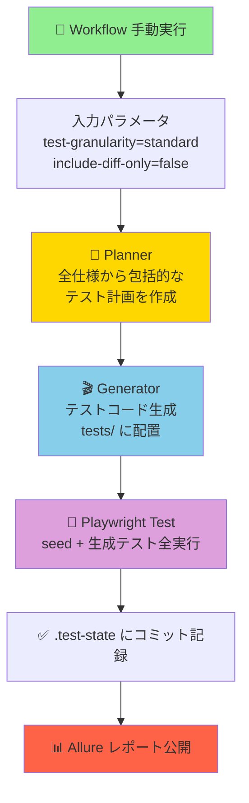
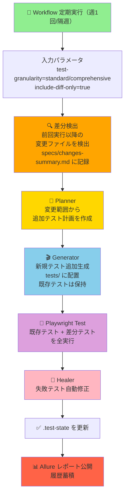

# Playwright Test Agents リポジトリ

🤖 Playwright Test Agents は、アプリのコードやマニュアルを入力として **テスト設計 → テスト実装 → テスト修正** を自動で行う仕組みです。手動で E2E テストを書く必要はありません。3 つのエージェント（🎭 Planner / 🎬 Generator / 🔧 Healer）がテストを生成し、失敗時は自動修正まで行います。

## 📌 期待する運用イメージ
- **📥 入力**: テスト対象のアプリコード、仕様/マニュアル（`specs/` などに置く）、必要な環境変数や資格情報。
- **⚙️ 自動化**: 🎭 Planner が計画を作り、🎬 Generator がテストコードを生成し、🔧 Healer が失敗を自動修正。
- **👤 人手の最小化**: テストケースの手書きや実装は不要。必要なのはアプリの実行環境と参照情報を与えることだけ。

## 📁 このリポジトリに含まれるもの
- **playwright.config.ts**: Playwright 設定。`PLAYWRIGHT_BASE_URL` などの環境変数で対象アプリを指定。
- **tests/**: 生成されたテストが置かれる場所。`seed.spec.ts` はプレースホルダーのスモーク枠で、実装必須ではありません。
- **specs/**: 🎭 Planner が出力するテスト計画（Markdown）。アプリのマニュアルや要件をここに置くと参照できます。
- **.github/workflows/playwright-agents-ci.yml**: CI でエージェントを実行し、アプリ起動→計画→生成→実行→レポート公開まで行うワークフロー。

## 🚀 最低限の準備（ローカル）
1) 依存関係をインストール: `npm ci`
2) テスト対象アプリを起動し、`PLAYWRIGHT_BASE_URL` でアクセス先を指定（例: `http://localhost:5173`）
3) VS Code でエージェント初期化: `npx playwright init-agents --loop=vscode`
4) テスト実行: `npx playwright test`（必要に応じて `seed.spec.ts` だけ先に回してもOK）

## ⚙️ CI の動き（playwright-agents-ci.yml 概要）
- ✅ アプリリポジトリと本リポジトリをチェックアウト
- ✅ `npm ci` と Playwright ブラウザ導入
- ✅ Docker Compose でテスト対象アプリを起動し、ヘルスチェック
- ✅ エージェント初期化 (`npx playwright init-agents --loop=vscode`)
- ✅ 🎭 Planner / 🎬 Generator / 🔧 Healer によりテスト生成と実行 (`npx playwright test`)
- ✅ 📊 Allure レポートを GitHub Pages に公開（main ブランチ時）

## 🎛️ GitHub Actions での実行設定

このワークフローは GitHub Actions の UI から手動実行（`workflow_dispatch`）でき、以下のパラメータで動作をカスタマイズできます：

### 1️⃣ テスト粒度の選択（`test-granularity`）
**デフォルト**: `standard`  
**選択肢**: `basic` / `standard` / `comprehensive`

- **basic** 🟢: 5-10 本の軽量テスト（正常系中心）
- **standard** 🟡: 20-30 本のテスト（正常系 + 主要なエッジケース）
- **comprehensive** 🔴: 50+ 本の詳細テスト（全シナリオ網羅）

🎭 Planner に `TEST_GRANULARITY` 環境変数が渡され、テスト計画の規模に反映されます。

### 2️⃣ テスト対象の指定（`app-repo-url` / `manual-url`）
**デフォルト app-repo-url**: `cocomomojo/test_app`

- **`app-repo-url`**: テスト対象アプリのリポジトリ（例: `your-org/your-app`）。未指定時は cocomomojo/test_app を使用。
- **`manual-url`**: マニュアルファイルの URL（Markdown 形式）。指定時は自動ダウンロードされ `specs/manual.md` に保存。

複数のアプリリポジトリを切り替えてテスト実行が可能です。

### 3️⃣ 差分ベースのテスト生成（`include-diff-only`）
**デフォルト**: `false`  
**選択肢**: `true` / `false`

`true` を選択すると、前回の実行コミット以降の変更ファイルを検出し、`specs/changes-summary.md` に出力。🎭 Planner が変更箇所の影響範囲を分析し、必要なテストに絞り込みます。**2 回目以降の実行を効率化**する機能です。

### 📊 パラメータの組み合わせ例

| app-repo-url | manual-url | 動作 |
|---|---|---|
| 未指定 | 未指定 | デフォルトリポ（cocomomojo/test_app）のコードのみでテスト設計 |
| 指定 | 未指定 | 指定したリポのコードのみでテスト設計 |
| 未指定 | 指定 | デフォルトリポ + ダウンロード済みマニュアルでテスト設計 |
| 指定 | 指定 | 指定したリポ + ダウンロード済みマニュアルでテスト設計 |

**注**: `app-repo-url` には常にデフォルト値（cocomomojo/test_app）が適用されるため、アプリコード参照は必ず行われます。

## 📋 定期実行による品質維持フロー

このプロジェクトは GitHub Actions で **定期的に自動実行** することで、アプリの品質を継続的に監視できます。

### 🔄 運用パターン

#### 【初回実行】フロー図



#### 【2回目以降】差分ベース実行フロー図



### 📊 品質維持のポイント

| フェーズ | 役割 | 備考 |
|---------|------|------|
| **入力** | 開発者が `app-repo-url` / `manual-url` を指定 | 自動で docs 取得 |
| **計画** | 🎭 Planner が仕様から包括的なテスト計画を作成 | `TEST_GRANULARITY` で規模制御 |
| **生成** | 🎬 Generator が `tests/` にテストコードを追加生成 | 既存テストは保持される |
| **実行** | Playwright が全テスト（既存 + 新規）を実行 | 差分モード時も全テスト実行 |
| **修正** | 🔧 Healer が失敗テストを自動修正（仕様変更なら手動確認推奨） | 誤検知回避 |
| **監視** | 📊 Allure で pass/fail 履歴を追跡 | GitHub Pages で常時公開 |

### 🎯 推奨される実行スケジュール

```
【初回】手動実行（初期テストスイート構築）
  ├─ test-granularity=standard
  ├─ app-repo-url=your-org/your-app  （または未指定）
  ├─ manual-url=https://...          （ある場合）
  └─ include-diff-only=false
         ↓
    全仕様から約 20-30 本のテスト生成
    テスト履歴が蓄積開始

【週 1 回 / 隔週】定期実行（品質継続監視）
  ├─ test-granularity=standard
  ├─ include-diff-only=true          （2回目以降）
  └─ 変更部分だけテスト生成（高速化）
         ↓
    既存テスト + 差分テストで品質監視

【月 1 回】詳細検査（comprehensive 実行）
  ├─ test-granularity=comprehensive
  ├─ include-diff-only=false         （全シナリオ確認）
  └─ 潜在的なエッジケース検証
         ↓
    50+ 本の詳細テスト実行
```

### ⚠️ 品質維持を確実にするための注意点

1. **📌 テスト成果物の保持**  
   生成テストが上書きされず累積されることを確認してください。初回実行時に `tests/` の内容をバックアップしておくと安心です。

2. **🔧 Healer の自動修正と手動確認**  
   Healer が自動修正した場合は Allure レポートに記録されます。仕様変更による失敗なら Allure コメント欄に手動注記すると、以降の判断が容易です。

3. **📈 Allure 履歴の追跡**  
   各実行の pass/fail、テスト数を Allure ダッシュボードで監視。突然の失敗率上昇は、アプリの回帰バグを示唆します。

4. **🔄 定期実行頻度**  
   変更が少なければ weekly でOK。変更が多いプロジェクトは 2-3 日おきの実行推奨。

---


## 💡 よくある質問
- **Q. 🤔 手動でテストを書かなくていいの？**  
  A. ✅ 基本不要です。アプリコードとマニュアルを入力すれば、エージェントが計画・生成・修正を担当します。スモーク用の `seed.spec.ts` は空でも構いません。

- **Q. 🤔 追加で人がやるべきことは？**  
  A. ✅ 対象アプリを起動できること、必要な環境変数・認証情報を渡すこと、仕様書/マニュアルを `specs/` などに置くことです。

- **Q. 🤔 既存テストを混ぜてもよい？**  
  A. ✅ 可能です。`tests/` に手書きテストを置いても、生成テストと共存できます。

- **Q. 🤔 粒度（granularity）の使い分けは？**  
  A. ✅ 初回は `standard` で十分。詳細検査が必要な場合は `comprehensive`、高速確認なら `basic` を選択。

- **Q. 🤔 差分モード（diff-only）を有効にしても大丈夫？**  
  A. ✅ 2 回目以降の実行推奨。初回は `false` で全テストを生成しておくと、以降の差分検出精度が向上します。

- **Q. 🤔 複数のアプリをテストする場合？**  
  A. ✅ `app-repo-url` で異なるリポジトリを指定して実行。各実行は独立したテスト計画を生成します。

## 📝 メモ
- ⚙️ `PLAYWRIGHT_BASE_URL` を CI/ローカルで適切に設定してください。
- 🤖 エージェント定義は `npx playwright init-agents --loop=vscode` で自動生成されます（既存生成物は `.github/agents/` 配下に置かれます）。

### 📊 ワークフローの特徴

| ステップ | 説明 | エージェント |
|---------|------|------------|
| **1-6** | 環境セットアップ・アプリ起動 | - |
| **7** | Playwright Agents 初期化 | - |
| **8** | Seed Test 実行 | - |
| **9** | テスト計画生成 | 🎭 Planner |
| **10** | テストコード生成 | 🎬 Generator |
| **11** | テスト実行 | - |
| **12** | 失敗テスト自動修正 | 🔧 Healer |
| **13-15** | レポート生成・公開 | - |
