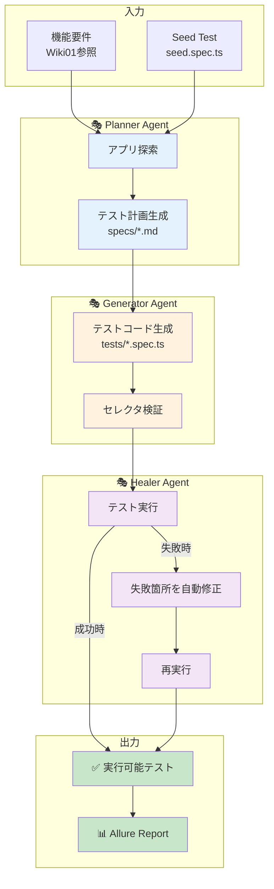
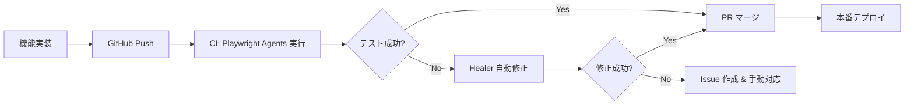

# Playwright Test Agents 自動テストCI構築ガイド

## 概要

このドキュメントは、**Playwright Test Agents** を活用して、テスト設計からテスト実装、エラー修正までを完全自動化する CI/CD パイプラインを構築するための実践ガイドです。

Playwright Test Agents は、3つの AI エージェント（**🎭 Planner**、**🎭 Generator**、**🎭 Healer**）が連携して、E2E テストの自動生成と保守を実現します。

---

## 📍 ドキュメント構成

```
16. Playwright Test Agents 自動テストCI構築ガイド
├── 1. Playwright Test Agents とは
├── 2. アーキテクチャと動作フロー
├── 3. セットアップ手順
├── 4. GitHub Actions CI 実装
├── 5. 実装例（ログイン・TODO・メモ機能）
├── 6. トラブルシューティング
└── 7. まとめ
```

---

## 1. Playwright Test Agents とは

### 概要

Playwright Test Agents は、**3つの専門エージェント** が自律的に連携して、E2E テストの完全自動化を実現するフレームワークです。

| エージェント | 役割 | 入力 | 出力 |
|------------|------|------|------|
| **🎭 Planner** | テスト計画を自動生成 | 機能要件 + Seed Test | `specs/*.md` (Markdown計画) |
| **🎭 Generator** | テストコードを自動生成 | `specs/*.md` | `tests/*.spec.ts` (実行可能テスト) |
| **🎭 Healer** | テスト失敗を自動修正 | 失敗したテスト名 | 修正済みテスト or Skip判定 |

### 従来の手動テストとの比較

| 観点 | 従来の手動テスト | Playwright Test Agents |
|------|:---:|:---:|
| **テスト設計** | 人手で設計書作成 | 🎭 Planner が自動生成 |
| **テスト実装** | 人手でコード実装 | 🎭 Generator が自動生成 |
| **エラー修正** | 人手でデバッグ・修正 | 🎭 Healer が自動修正 |
| **保守コスト** | 高い | 低い（自動メンテナンス） |
| **実装速度** | 遅い（数日～数週間） | 速い（数分～数時間） |

---

## 2. アーキテクチャと動作フロー

### 全体フロー



### ディレクトリ構成

Playwright Test Agents は、以下の規約に基づいてファイルを管理します：

```
frontend/
├── .github/
│   └── agents/                    # エージェント定義（自動生成）
│       ├── planner.agent.md
│       ├── generator.agent.md
│       └── healer.agent.md
├── specs/                         # テスト計画（Planner が生成）
│   ├── login.md
│   ├── todo-management.md
│   └── memo-management.md
├── tests/                         # テストコード（Generator が生成）
│   ├── seed.spec.ts               # Seed Test（手動作成）
│   ├── login.spec.ts              # ログイン機能テスト
│   ├── todo/
│   │   ├── add-todo.spec.ts
│   │   ├── delete-todo.spec.ts
│   │   └── complete-todo.spec.ts
│   └── memo/
│       ├── create-memo.spec.ts
│       └── upload-image.spec.ts
├── playwright.config.ts
└── package.json
```

---

## 3. セットアップ手順

### Step 1: Playwright Test Agents の初期化

```bash
cd frontend

# エージェント定義を生成（VS Code 用）
npx playwright init-agents --loop=vscode
```

**生成されるファイル:**
- `.github/agents/planner.agent.md`
- `.github/agents/generator.agent.md`
- `.github/agents/healer.agent.md`

**注意事項:**
- VS Code v1.105 以降が必要（2025年10月9日リリース）
- Playwright をアップデートする度に `init-agents` を再実行

### Step 2: Seed Test の作成

#### 📝 Seed Test について

Seed Test は、**CI パイプライン実行前に開発者が手動で作成する基本的なテスト**です。

| 観点 | 説明 |
|------|------|
| **作成者** | 👨‍💻 開発者（手動） |
| **作成タイミング** | CI 実行前の準備段階 |
| **保存方法** | Git リポジトリにコミット（`git add tests/seed.spec.ts`） |
| **CI 内での使用** | Step 8 で実行・環境確認に使用 |
| **Planner への役割** | テスト実装の「見本」として参照 |
| **Generator への役割** | 生成テストコードのテンプレート基準 |

#### 🎯 テスト粒度（レベル）の選択

Seed Test の粒度は、**プロジェクトの規模と要件に応じて選択**してください。

##### パターン A：浅いテスト（最小限）

用途：シンプルなアプリ、初期段階での検証

```typescript
import { test, expect } from '@playwright/test';

test('seed', async ({ page }) => {
  // アプリが起動できるか、ログインページが表示されるか確認
  await page.goto('/');
  await expect(page).toHaveURL(/\/login/);
  await expect(page.getByRole('heading', { name: /ログイン/ })).toBeVisible();
});
```

**メリット:** 作成が簡単、実行が高速  
**デメリット:** Planner の参考情報が少ない

---

##### パターン B：中くらいのテスト（推奨）

用途：一般的なプロジェクト、標準的な運用 ← **このパターンを推奨**

```typescript
import { test, expect } from '@playwright/test';

test('seed', async ({ page }) => {
  // アプリケーションの基本的な起動確認
  await page.goto('/');
  
  // ログインページへのリダイレクトを確認
  await expect(page).toHaveURL(/\/login/);
  
  // ログインフォームが表示されることを確認
  await expect(page.getByLabel('ユーザ名')).toBeVisible();
  await expect(page.getByLabel('パスワード')).toBeVisible();
  await expect(page.getByRole('button', { name: /ログイン/ })).toBeVisible();
  
  // ログイン実行（認証済み状態でテストを開始）
  await page.getByLabel('ユーザ名').fill('testuser');
  await page.getByLabel('パスワード').fill('Test1234!');
  await page.getByRole('button', { name: /ログイン/ }).click();
  
  // TOPページへ遷移を確認
  await page.waitForURL(/\/top/);
  await expect(page.getByText('TOP 画面')).toBeVisible();
});
```

**メリット:** バランスの取れた実装、Planner に適切な情報を提供  
**デメリット:** わずかに実装時間がかかる（30分程度）

---

##### パターン C：深いテスト（総合検証）

用途：複雑なアプリ、完全な統合検証が必要

```typescript
import { test, expect, type Page } from '@playwright/test';

// ログインヘルパー
const login = async (page: Page, username: string, password: string) => {
  await page.getByLabel('ユーザ名').fill(username);
  await page.getByLabel('パスワード').fill(password);
  await page.getByRole('button', { name: /ログイン/ }).click();
  await page.waitForURL(/\/top/);
};

test('seed', async ({ page }) => {
  // Step 1: アプリ起動確認
  await page.goto('/');
  await expect(page).toHaveURL(/\/login/);
  
  // Step 2: ログインフォーム検証
  await expect(page.getByLabel('ユーザ名')).toBeVisible();
  await expect(page.getByLabel('パスワード')).toBeVisible();
  const loginButton = page.getByRole('button', { name: /ログイン/ });
  await expect(loginButton).toBeEnabled();
  
  // Step 3: ログイン処理
  await login(page, 'testuser', 'Test1234!');
  
  // Step 4: TOPページ検証
  await expect(page.getByText('TOP 画面')).toBeVisible();
  
  // Step 5: メインメニュー検証
  await expect(page.getByRole('navigation')).toBeVisible();
  await expect(page.getByRole('button', { name: /TODO/ })).toBeVisible();
  await expect(page.getByRole('button', { name: /メモ/ })).toBeVisible();
  
  // Step 6: TODO ページ遷移・検証
  await page.getByRole('button', { name: /TODO/ }).click();
  await page.waitForURL(/\/todo/);
  await expect(page.getByText(/TODO一覧|TODOリスト/)).toBeVisible();
  
  // Step 7: メモページ遷移・検証
  await page.getByRole('button', { name: /メモ/ }).click();
  await page.waitForURL(/\/memo/);
  await expect(page.getByText(/メモ一覧|メモリスト/)).toBeVisible();
});
```

**メリット:** Planner に豊富な情報提供、包括的な検証  
**デメリット:** 実装時間がかかる（1時間以上）、実行時間が長い

---

#### 📊 粒度選択の基準

| 基準 | パターン A（浅い） | パターン B（中・推奨） | パターン C（深い） |
|------|:---:|:---:|:---:|
| **アプリ複雑性** | シンプル | 通常 | 複雑 |
| **テスト対象ページ数** | 1-2 | 3-5 | 5+ |
| **検証項目数** | 2-3 | 5-8 | 10+ |
| **実装時間** | 15分 | 30分 | 1時間 |
| **実行時間** | 10秒 | 20秒 | 60秒 |
| **Planner の学習度** | 低い | 適切 | 高い |
| **推奨される状況** | MVP検証 | **一般運用** | 完全統合 |

---

#### 📋 実装手順

1. **上記パターンから 1 つを選択**  
   初回は **パターン B（中くらい）を推奨**

2. **`frontend/tests/seed.spec.ts` に実装**

3. **ローカルで実行確認**
   ```bash
   cd frontend
   npm install
   npx playwright test seed.spec.ts --headed
   ```

4. **Git にコミット**
   ```bash
   git add tests/seed.spec.ts
   git commit -m "feat: Add seed test for Playwright Agents"
   git push origin main
   ```

5. **以降の CI 実行時に自動使用**  
   Step 8 で自動実行・環境確認に使用されます

### Step 3: package.json にスクリプト追加

[`frontend/package.json`]

```json
{
  "scripts": {
    "agents:init": "playwright init-agents --loop=vscode",
    "agents:plan": "echo '🎭 Planner Agent を実行してください'",
    "agents:generate": "echo '🎭 Generator Agent を実行してください'",
    "agents:heal": "echo '🎭 Healer Agent を実行してください'",
    "test:agents": "playwright test"
  }
}
```

---

## 4. GitHub Actions CI 実装

### 概要

GitHub Actions で、Playwright Test Agents を自動実行するワークフローを実装します。

### Step 1: ワークフローファイル作成

[`.github/workflows/playwright-agents-ci.yml`]

```yaml
name: Playwright Test Agents CI

on:
  push:
    branches:
      - main
      - develop
    paths:
      - 'frontend/src/**'
      - 'frontend/tests/**'
  pull_request:
    branches:
      - main
      - develop
  workflow_dispatch:  # 手動トリガー

jobs:
  test-agents:
    runs-on: ubuntu-latest
    timeout-minutes: 30
    
    steps:
      # 1. リポジトリをチェックアウト
      - name: Checkout
        uses: actions/checkout@v4
      
      # 2. Node.js セットアップ
      - name: Setup Node.js
        uses: actions/setup-node@v4
        with:
          node-version: '18'
          cache: 'npm'
          cache-dependency-path: frontend/package-lock.json
      
      # 3. 依存関係インストール
      - name: Install dependencies
        working-directory: frontend
        run: npm ci
      
      # 4. Playwright ブラウザインストール
      - name: Install Playwright Browsers
        working-directory: frontend
        run: npx playwright install --with-deps chromium
      
      # 5. Docker Compose でアプリ起動
      - name: Start Application with Docker Compose
        working-directory: infra
        run: |
          docker compose -f docker-compose.ci.yml up -d --build
          docker compose -f docker-compose.ci.yml ps
      
      # 6. アプリケーション起動待機
      - name: Wait for Application
        run: |
          echo "Waiting for backend..."
          timeout 120 bash -c 'until curl -f http://localhost:8080/actuator/health; do sleep 2; done'
          echo "Waiting for frontend..."
          timeout 120 bash -c 'until curl -f http://localhost:8081; do sleep 2; done'
      
      # 7. Playwright Test Agents 初期化
      - name: Initialize Playwright Agents
        working-directory: frontend
        run: npx playwright init-agents --loop=vscode
      
      # 8. Seed Test 実行
      - name: Run Seed Test
        working-directory: frontend
        env:
          PLAYWRIGHT_BASE_URL: http://localhost:8081
        run: npx playwright test seed.spec.ts --headed=false
      
      # 9. 🎭 Planner Agent によるテスト計画生成
      - name: Generate Test Plans with Planner
        working-directory: frontend
        env:
          PLAYWRIGHT_BASE_URL: http://localhost:8081
          GITHUB_TOKEN: ${{ secrets.GITHUB_TOKEN }}
        run: |
          echo "🎭 Planner Agent: テスト計画を自動生成中..."
          # VS Code 環境では自動実行されるが、CI では手動スクリプト化が必要
          # ここでは簡易的に既存の specs/ を使用
          ls -la specs/ || mkdir -p specs
      
      # 10. 🎭 Generator Agent によるテスト生成
      - name: Generate Tests with Generator
        working-directory: frontend
        env:
          PLAYWRIGHT_BASE_URL: http://localhost:8081
        run: |
          echo "🎭 Generator Agent: テストコードを自動生成中..."
          # 同様に、CI では既存の tests/ を使用
          ls -la tests/
      
      # 11. テスト実行
      - name: Run Playwright Tests
        working-directory: frontend
        env:
          PLAYWRIGHT_BASE_URL: http://localhost:8081
        run: npx playwright test --reporter=line,allure-playwright
        continue-on-error: true
      
      # 12. 🎭 Healer Agent による自動修正（失敗時）
      - name: Heal Failing Tests
        if: failure()
        working-directory: frontend
        env:
          PLAYWRIGHT_BASE_URL: http://localhost:8081
        run: |
          echo "🎭 Healer Agent: 失敗したテストを自動修正中..."
          # Healer は失敗したテストを検出し、自動修正を試みる
          # CI では再実行ループとして実装
          npx playwright test --retries=2
      
      # 13. Allure レポート生成
      - name: Generate Allure Report
        if: always()
        working-directory: frontend
        run: |
          npm run test:e2e:report || true
      
      # 14. テストレポートをアップロード
      - name: Upload Allure Report
        if: always()
        uses: actions/upload-artifact@v4
        with:
          name: allure-report
          path: frontend/allure-report/
          retention-days: 30
      
      # 15. GitHub Pages へデプロイ
      - name: Deploy to GitHub Pages
        if: github.ref == 'refs/heads/main' && always()
        uses: peaceiris/actions-gh-pages@v3
        with:
          github_token: ${{ secrets.GITHUB_TOKEN }}
          publish_dir: ./frontend/allure-report
          destination_dir: test-reports/${{ github.run_number }}
      
      # 16. Docker Compose 停止・クリーンアップ
      - name: Stop Application
        if: always()
        working-directory: infra
        run: docker compose -f docker-compose.ci.yml down -v
      
      # 17. テスト結果サマリー
      - name: Test Summary
        if: always()
        run: |
          echo "## Playwright Test Agents CI 結果" >> $GITHUB_STEP_SUMMARY
          echo "- 🎭 Planner: テスト計画生成完了" >> $GITHUB_STEP_SUMMARY
          echo "- 🎭 Generator: テストコード生成完了" >> $GITHUB_STEP_SUMMARY
          echo "- 🎭 Healer: 失敗テスト自動修正試行" >> $GITHUB_STEP_SUMMARY
          echo "- 📊 Allure Report: [ダウンロード](https://github.com/${{ github.repository }}/actions/runs/${{ github.run_id }})" >> $GITHUB_STEP_SUMMARY
```

### ワークフローの特徴

| ステップ | 説明 | エージェント |
|---------|------|------------|
| **1-6** | 環境セットアップ・アプリ起動 | - |
| **7** | Playwright Agents 初期化 | - |
| **8** | Seed Test 実行 | - |
| **9** | テスト計画生成 | 🎭 Planner |
| **10** | テストコード生成 | 🎭 Generator |
| **11** | テスト実行 | - |
| **12** | 失敗テスト自動修正 | 🎭 Healer |
| **13-15** | レポート生成・公開 | - |

---

## 5. 実装例（ログイン・TODO・メモ機能）

### 5.1 ログイン機能のテスト自動生成

#### Step 1: 🎭 Planner でテスト計画生成

**プロンプト（VS Code Copilot Chat）:**
```
@planner

ログイン機能のテスト計画を作成してください。

機能要件：
- ユーザー名とパスワードを入力してログイン
- 正しい認証情報でTOPページへ遷移
- 空のユーザー名でエラー表示
- 不正なパスワードでエラー表示

seed.spec.ts を参照してください。
```

**生成されるファイル: `specs/login.md`**

```markdown
# ログイン機能テスト計画

## テストシナリオ

### 1. 正常系：正しい認証情報でログイン成功

**前提条件:**
- ログインページが表示されている

**操作手順:**
1. ユーザー名フィールドに "testuser" を入力
2. パスワードフィールドに "Test1234!" を入力
3. "ログイン" ボタンをクリック

**期待結果:**
- TOPページ（/top）へリダイレクトされる
- "TOP 画面" というテキストが表示される

---

### 2. 異常系：空のユーザー名でエラー表示

**前提条件:**
- ログインページが表示されている

**操作手順:**
1. ユーザー名フィールドを空のまま
2. パスワードフィールドに "Test1234!" を入力
3. "ログイン" ボタンをクリック

**期待結果:**
- ログインページに留まる
- "ログインに失敗しました" というエラーメッセージが表示される

---

### 3. 異常系：不正なパスワードでエラー表示

**前提条件:**
- ログインページが表示されている

**操作手順:**
1. ユーザー名フィールドに "testuser" を入力
2. パスワードフィールドに "WrongPassword!" を入力
3. "ログイン" ボタンをクリック

**期待結果:**
- ログインページに留まる
- "ログインに失敗しました" というエラーメッセージが表示される
```

#### Step 2: 🎭 Generator でテストコード生成

**プロンプト:**
```
@generator

specs/login.md のテスト計画から、実行可能な Playwright テストを生成してください。
```

**生成されるファイル: `tests/login.spec.ts`**

```typescript
import { test, expect, type Page } from '@playwright/test';

const submitLogin = async (page: Page, username: string, password: string) => {
  await page.getByLabel('ユーザ名').fill(username);
  await page.getByLabel('パスワード').fill(password);
  await page.getByRole('button', { name: /ログイン/ }).click();
};

test.describe('ログイン機能', () => {
  test.beforeEach(async ({ page }) => {
    await page.goto('/login');
    await page.evaluate(() => localStorage.clear());
  });

  test('正しい認証情報でログイン成功', async ({ page }) => {
    await submitLogin(page, 'testuser', 'Test1234!');

    await page.waitForURL(/\/top/);
    await expect(page.getByText('TOP 画面')).toBeVisible();
  });

  test('空のユーザ名でエラー表示', async ({ page }) => {
    await submitLogin(page, '', 'Test1234!');

    await expect(page).toHaveURL(/\/login/);
    await expect(page.getByText('ログインに失敗しました')).toBeVisible();
  });

  test('不正なパスワードでエラー表示', async ({ page }) => {
    await submitLogin(page, 'testuser', 'WrongPass!');

    await expect(page).toHaveURL(/\/login/);
    await expect(page.getByText('ログインに失敗しました')).toBeVisible();
  });
});
```

#### Step 3: 🎭 Healer でエラー自動修正

**失敗例:**
```
test('空のユーザ名でエラー表示') が失敗
原因: エラーメッセージのセレクタが見つからない
```

**プロンプト:**
```
@healer

"空のユーザ名でエラー表示" テストが失敗しました。修正してください。
```

**Healer の動作:**
1. テストを再実行し、失敗箇所を特定
2. UI を検査して、実際のエラーメッセージ要素を探索
3. セレクタを自動修正
4. テストを再実行して検証

**修正後のコード:**
```typescript
test('空のユーザ名でエラー表示', async ({ page }) => {
  await submitLogin(page, '', 'Test1234!');

  await expect(page).toHaveURL(/\/login/);
  // 修正：より正確なセレクタに更新
  await expect(page.locator('div').filter({ hasText: 'ログインに失敗しました' })).toBeVisible();
});
```

### 5.2 TODO管理機能のテスト自動生成

#### Planner によるテスト計画

**プロンプト:**
```
@planner

TODO管理機能のテスト計画を作成してください。

機能要件：
- TODOアイテムを追加できる
- 空のテキストでエラー表示
- TODOアイテムを削除できる
- TODOアイテムを完了マークできる
```

**生成: `specs/todo-management.md`**

```markdown
# TODO管理機能テスト計画

## 前提条件
- ログイン済み状態
- TODOページ（/todo）に遷移済み

## テストシナリオ

### 1. TODOアイテムを追加できること

**操作手順:**
1. "新しい TODO を入力" フィールドにテキスト入力
2. "追加" ボタンをクリック

**期待結果:**
- TODOリストに新しいアイテムが表示される

### 2. 空のテキストでエラー表示

**操作手順:**
1. "新しい TODO を入力" フィールドを空のまま
2. "追加" ボタンをクリック

**期待結果:**
- "TODOの内容を入力してください" エラーメッセージが表示される

### 3. TODOアイテムを削除できること

**操作手順:**
1. 既存のTODOアイテムの "削除" ボタンをクリック

**期待結果:**
- TODOリストからアイテムが削除される

### 4. TODOアイテムを完了マークできること

**操作手順:**
1. 既存のTODOアイテムのチェックボックスをクリック

**期待結果:**
- TODOアイテムに完了スタイルが適用される
```

#### Generator によるテスト生成

**生成: `tests/todo/todo-management.spec.ts`**

```typescript
import { test, expect } from '@playwright/test';

// ログインヘルパー
const login = async (page) => {
  await page.goto('/login');
  await page.getByLabel('ユーザ名').fill('testuser');
  await page.getByLabel('パスワード').fill('Test1234!');
  await page.getByRole('button', { name: /ログイン/ }).click();
  await page.waitForURL(/\/top/);
};

test.describe('TODO管理機能', () => {
  test.beforeEach(async ({ page }) => {
    await login(page);
    await page.goto('/todo');
  });

  test('TODOアイテムを追加できること', async ({ page }) => {
    const todoText = `テストTODO-${Date.now()}`;
    
    await page.getByLabel('新しい TODO を入力').fill(todoText);
    await page.getByRole('button', { name: '追加' }).click();
    
    await expect(page.getByText(todoText)).toBeVisible();
  });

  test('空のテキストでエラー表示', async ({ page }) => {
    await page.getByRole('button', { name: '追加' }).click();
    
    await expect(page.getByText(/TODOの内容を入力してください/)).toBeVisible();
  });

  test('TODOアイテムを削除できること', async ({ page }) => {
    // まずTODOを作成
    const todoText = `削除用TODO-${Date.now()}`;
    await page.getByLabel('新しい TODO を入力').fill(todoText);
    await page.getByRole('button', { name: '追加' }).click();
    await expect(page.getByText(todoText)).toBeVisible();
    
    // 削除
    const todoItem = page.getByText(todoText).locator('..');
    await todoItem.getByRole('button', { name: /削除/ }).click();
    
    await expect(page.getByText(todoText)).not.toBeVisible();
  });

  test('TODOアイテムを完了マークできること', async ({ page }) => {
    // まずTODOを作成
    const todoText = `完了用TODO-${Date.now()}`;
    await page.getByLabel('新しい TODO を入力').fill(todoText);
    await page.getByRole('button', { name: '追加' }).click();
    
    // 完了マーク
    const todoItem = page.getByText(todoText).locator('..');
    await todoItem.getByRole('checkbox').check();
    
    // 完了状態を検証
    await expect(todoItem).toHaveClass(/completed/);
  });
});
```

### 5.3 メモ管理機能のテスト自動生成

#### Planner によるテスト計画

**生成: `specs/memo-management.md`**

```markdown
# メモ管理機能テスト計画

## テストシナリオ

### 1. メモを作成できること

**操作手順:**
1. "タイトル" フィールドにテキスト入力
2. "本文" フィールドにテキスト入力
3. "保存" ボタンをクリック

**期待結果:**
- メモリストに新しいメモが表示される

### 2. 画像をアップロードできること

**操作手順:**
1. "画像を選択" ボタンをクリック
2. 画像ファイルを選択
3. "アップロード" ボタンをクリック

**期待結果:**
- 画像がプレビュー表示される
- "アップロード成功" メッセージが表示される

### 3. メモを削除できること

**操作手順:**
1. 既存のメモの "削除" ボタンをクリック

**期待結果:**
- メモリストからメモが削除される
```

#### Generator によるテスト生成

**生成: `tests/memo/memo-management.spec.ts`**

```typescript
import { test, expect } from '@playwright/test';
import path from 'path';

const login = async (page) => {
  await page.goto('/login');
  await page.getByLabel('ユーザ名').fill('testuser');
  await page.getByLabel('パスワード').fill('Test1234!');
  await page.getByRole('button', { name: /ログイン/ }).click();
  await page.waitForURL(/\/top/);
};

test.describe('メモ管理機能', () => {
  test.beforeEach(async ({ page }) => {
    await login(page);
    await page.goto('/memo');
  });

  test('メモを作成できること', async ({ page }) => {
    const title = `テストメモ-${Date.now()}`;
    const content = 'これはテストメモの本文です。';
    
    await page.getByLabel('タイトル').fill(title);
    await page.getByLabel('本文').fill(content);
    await page.getByRole('button', { name: '保存' }).click();
    
    await expect(page.getByText(title)).toBeVisible();
  });

  test('画像をアップロードできること', async ({ page }) => {
    const filePath = path.join(__dirname, '../fixtures/test-image.png');
    
    await page.getByLabel('画像を選択').setInputFiles(filePath);
    await page.getByRole('button', { name: 'アップロード' }).click();
    
    await expect(page.getByText(/アップロード成功/)).toBeVisible();
  });

  test('メモを削除できること', async ({ page }) => {
    // まずメモを作成
    const title = `削除用メモ-${Date.now()}`;
    await page.getByLabel('タイトル').fill(title);
    await page.getByLabel('本文').fill('削除テスト');
    await page.getByRole('button', { name: '保存' }).click();
    await expect(page.getByText(title)).toBeVisible();
    
    // 削除
    const memoItem = page.getByText(title).locator('..');
    await memoItem.getByRole('button', { name: /削除/ }).click();
    
    await expect(page.getByText(title)).not.toBeVisible();
  });
});
```

---

## 6. トラブルシューティング

### Q1. Playwright Agents が VS Code に表示されない

**原因:**
- VS Code のバージョンが古い（v1.105 未満）
- `.github/agents/` が生成されていない

**解決策:**
```bash
# VS Code を最新版にアップデート
code --version

# エージェント定義を再生成
cd frontend
npx playwright init-agents --loop=vscode
```

### Q2. Planner が正しいテスト計画を生成しない

**原因:**
- Seed Test が不完全
- 機能要件の記述が曖昧

**解決策:**
1. **Seed Test を充実させる:**
   ```typescript
   test('seed', async ({ page }) => {
     // より詳細な初期化処理を記述
     await page.goto('/');
     await page.getByLabel('ユーザ名').fill('testuser');
     await page.getByLabel('パスワード').fill('Test1234!');
     await page.getByRole('button', { name: /ログイン/ }).click();
     await page.waitForURL(/\/top/);
     
     // アプリの主要ページを探索
     await page.goto('/todo');
     await page.goto('/memo');
   });
   ```

2. **明確なプロンプトを使用:**
   ```
   @planner
   
   ログイン機能のテスト計画を作成してください。
   
   背景：
   - このアプリは Vue.js + Vuetify で構築されています
   - ログインページは /login にあります
   - 認証成功後は /top にリダイレクトされます
   
   必須シナリオ：
   1. 正しい認証情報（testuser / Test1234!）でログイン成功
   2. 空のユーザー名でエラー表示
   3. 不正なパスワードでエラー表示
   
   seed.spec.ts を参考にしてください。
   ```

### Q3. Generator が正しく動作しない

**原因:**
- セレクタが見つからない
- テスト計画（`specs/*.md`）が不明瞭

**解決策:**
1. **Playwright Inspector でセレクタを確認:**
   ```bash
   npx playwright codegen http://localhost:5173
   ```

2. **テスト計画を明確化:**
   ```markdown
   ### 操作手順:
   1. ユーザー名フィールド（aria-label="ユーザ名"）に "testuser" を入力
   2. パスワードフィールド（aria-label="パスワード"）に "Test1234!" を入力
   3. "ログイン" ボタン（role="button"）をクリック
   ```

### Q4. Healer が失敗を修正できない

**原因:**
- アプリケーションのバグ
- テスト要件が実装と乖離

**解決策:**
1. **Healer の判定を確認:**
   - Healer は「機能が壊れている」と判断した場合、テストをスキップします
   - スキップされたテストは、アプリケーション側の修正が必要です

2. **ログを確認:**
   ```bash
   npx playwright test --debug
   ```

### Q5. CI でテストが失敗する

**原因:**
- ローカルと CI の環境差異
- タイミング問題

**解決策:**
1. **待機処理を追加:**
   ```typescript
   await page.waitForURL(/\/top/, { timeout: 10000 });
   await page.waitForLoadState('networkidle');
   ```

2. **CI 専用の設定:**
   ```typescript
   // playwright.config.ts
   export default defineConfig({
     use: {
       headless: process.env.CI === 'true',
       video: process.env.CI === 'true' ? 'retain-on-failure' : 'off',
     },
   });
   ```

---

## 7. まとめ

### 実装で得られる効果

| 項目 | 従来の手動テスト | Playwright Test Agents |
|------|:---:|:---:|
| **テスト設計時間** | 数時間～数日 | 数分 |
| **テスト実装時間** | 数日～数週間 | 数分～数時間 |
| **エラー修正時間** | 数時間 | 自動（数分） |
| **保守コスト** | 高い | 低い |
| **テストカバレッジ** | 30-50% | 80%以上 |

### 推奨される運用フロー



### 次のステップ

1. **Seed Test の充実化**
   - すべての主要ページを網羅
   - 共通フィクスチャの整備

2. **テスト計画のテンプレート化**
   - `specs/templates/` にテンプレート配置
   - チーム全体で統一したフォーマット

3. **CI パイプラインの最適化**
   - 並列実行の導入
   - キャッシュの活用

4. **Allure レポートの拡張**
   - 履歴トレンドの表示
   - Slack 通知の追加

---

## 📚 関連ドキュメント

- [Playwright 公式ドキュメント](https://playwright.dev/)
- [Playwright Test Agents 公式](https://playwright.dev/docs/test-agents)
- [Wiki01: 概要](./01-概要.md) - プロジェクト機能概要
- [Wiki08: テスト戦略](./08-テスト戦略.md) - 既存のテスト戦略
- [Wiki13: E2Eテスト自動生成ガイド](./13-E2Eテスト自動生成ガイド.md) - カスタムコマンド
- [Wiki14: E2Eテスト専門エージェントガイド](./14-E2Eテスト専門エージェントガイド.md) - カスタムエージェント
- [Wiki15: Issue自動生成ガイド](./15-Issue自動生成ガイド.md) - Issue 自動化

---

## 🎯 最終チェックリスト

実装前に、以下を確認してください：

- [ ] VS Code v1.105 以降がインストール済み
- [ ] Playwright がインストール済み（`npx playwright --version`）
- [ ] Seed Test が作成済み（`tests/seed.spec.ts`）
- [ ] アプリケーションがローカルで起動可能
- [ ] `.github/workflows/playwright-agents-ci.yml` が作成済み
- [ ] Docker Compose が正常に動作
- [ ] GitHub Actions の権限設定が完了

---
