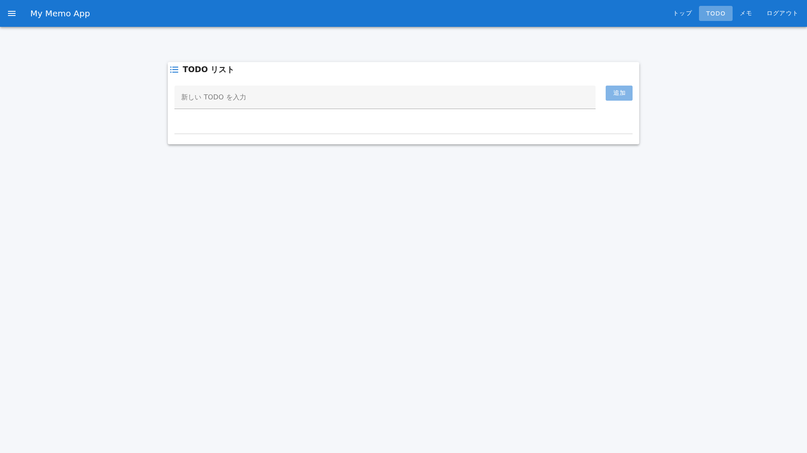
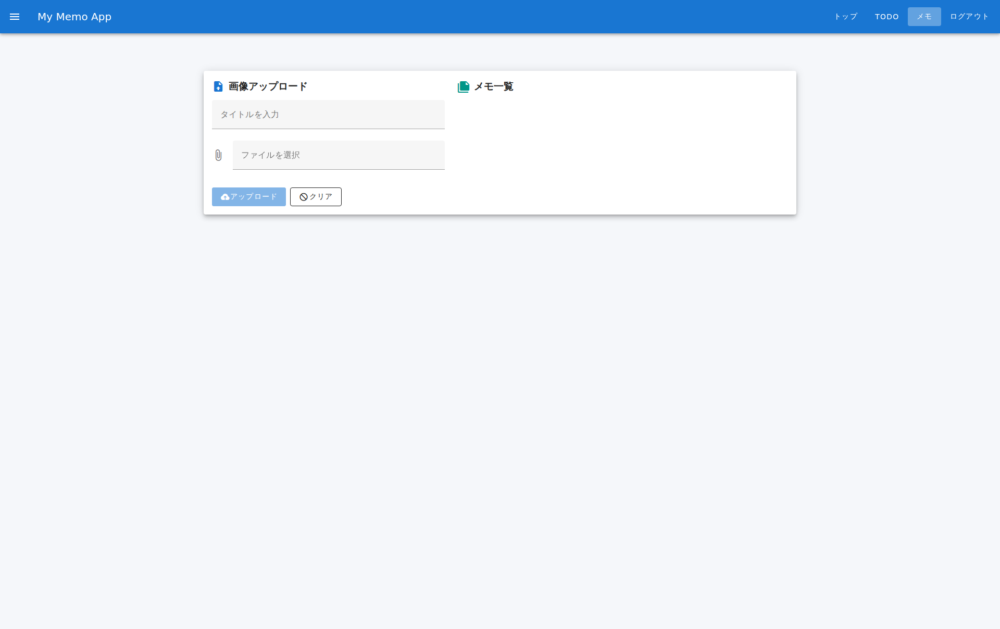

# TODO機能 ユーザー向け操作マニュアル

## 1. 概要

### この機能について

TODO機能は、日々のタスク・業務を管理するための基本機能です。やることをシンプルに記録し、完了したら「完了」をクリック、不要なら「削除」できます。トップページのナビゲーションから「TODO」ボタンをクリックするだけで、あなたのタスク一覧にアクセスでき、新規追加・完了管理・削除がすぐに行えます。

### 利用シーン

1. **朝の業務開始時にシステムにアクセスする**  
   出勤後、ログインして「TODO」ボタンをクリック。本日のタスク一覧を確認し、優先順位を意識しながら業務を進めることで、業務効率が向上します。

2. **業務進行中に新しいタスクが発生した場合**  
   急な依頼や新しい業務が発生した際、TODO機能にすぐに追加。入力フィールドに業務内容を記載するだけで、タスク管理が統一されます。

3. **業務完了時にタスクをチェックする**  
   タスクが完了したら、完了マークをつけることで、進捗状況が一目で把握でき、次の業務へスムーズに移行できます。

---

## 2. 前提条件

### 必要な権限やアクセス権

- システムへのログイン権限が必要です
- ユーザーアカウントが有効化されていることを確認してください
- 通常のユーザー権限で使用可能です（特別な権限は不要）

### テストアカウント情報

テスト・検証で使用可能なアカウント情報については、[テストアカウント情報](../test-accounts.md)を参照してください。

### 推奨環境

- **ブラウザ**: Google Chrome、Firefox、Safari の最新バージョン
- **デバイス**: パソコン、タブレット（スマートフォンでも使用可能）
- **ネットワーク環境**: インターネット接続が安定している環境

---

## 3. 基本操作

### ステップ 1: ログイン

1. ブラウザでアプリケーションにアクセスします
2. ログイン画面が表示されます
3. 「ユーザー名」入力フィールドに、割り当てられたユーザー名を入力します
4. 「パスワード」入力フィールドに、パスワードを入力します
5. 「ログイン」ボタンをクリックします
6. ログインに成功すると、ダッシュボード（メインページ）に遷移します

### ステップ 2: TODO機能へのアクセス

1. ログイン後、ダッシュボードが表示されます
2. 画面上部のナビゲーションメニューから「TODO」ボタンをクリックします
3. TODO一覧ページが表示され、現在登録されているタスク一覧が表示されます

### ステップ 3: 新しいTODOを作成する

1. TODO一覧ページで、ナビゲーションメニューの下にある入力フィールドにタスク名を入力します
2. 例：「報告書の作成」「メール返信」「会議資料の準備」など、具体的なタスク内容を記載します
3. Enterキーを押すか、その横の「追加」ボタン（またはアイコン）をクリックします
4. 新しいタスクが一覧に追加されます

### ステップ 4: TODOを完了マークする

1. TODO一覧で、完了したタスクの横にある「完了」ボタンをクリックします
2. タスクが完了状態に変わります（リスト上での表示が変更されます）
3. 完了したタスクは視覚的に区別され、未完了のタスクとの判別が容易になります

### ステップ 5: TODOを削除する

1. TODO一覧で、不要なタスクの横にある「削除」ボタンをクリックします
2. タスクが一覧から削除されます（確認ダイアログが表示される場合もあります）

### ステップ 6: ログアウト

1. 画面上部のナビゲーションメニューから「ログアウト」ボタンをクリックします
2. セッションが終了し、ログイン画面に戻ります
3. 次回のアクセス時は、再度ログインが必要になります

---

## 4. 詳細機能

### タスク一覧の管理

- **タスク順序の確認**: TODO一覧は、作成順序に表示されます
- **複数タスクの同時管理**: 複数のタスクを同時に管理でき、スクロールで全タスクを確認できます
- **完了状態の確認**: 完了したタスクと未完了のタスクが視覚的に区別されます

### ページ間のナビゲーション

- **トップページへの移動**: ナビゲーションの「トップ」ボタンで、ダッシュボードに戻ります
- **メモ機能への移動**: ナビゲーションの「メモ」ボタンで、メモ管理機能に切り替えられます
- **セッション管理**: 「ログアウト」ボタンで安全にセッションを終了できます

### データの永続性

- 作成・編集したタスクはシステムに自動保存されます
- ログアウト後も、次回ログイン時にタスクは保持されています
- タスク削除後は、復元できない場合があるため、注意してください

---

## 5. トラブルシューティング

### ログインできない場合

**エラーメッセージ**: 「ユーザー名またはパスワードが正しくありません」

**対処方法**:
1. ユーザー名のスペルが正確であるか確認してください
2. Caps Lock キーが有効になっていないか確認してください
3. パスワードに間違いがないか再度確認してください
4. 管理者に問い合わせて、アカウント情報をリセットしてもらってください

### TODO一覧が表示されない場合

**原因**: ネットワーク接続の問題またはサーバー側の問題

**対処方法**:
1. インターネット接続が正常であることを確認してください
2. ブラウザを再読み込み（F5キーまたはⓡ ボタン）してください
3. キャッシュをクリアして、再度アクセスしてください
4. 別のブラウザで試してみてください

### タスク追加ボタンが反応しない場合

**原因**: ブラウザの不具合またはJavaScript の無効化

**対処方法**:
1. ブラウザのキャッシュをクリアしてください
2. ブラウザを再起動してください
3. JavaScript が有効になっているか確認してください（ブラウザの設定から）
4. 別のブラウザを試してみてください

### スクリーンショットが表示されない場合

**原因**: ブラウザの画像読み込み設定またはネットワーク問題

**対処方法**:
1. ネットワーク接続を確認してください
2. ブラウザのコンソール（F12キー）でエラーを確認してください
3. 画像キャッシュをクリアして再読み込みしてください

---

## 6. よくある質問（FAQ）

### Q1: タスクの作成に上限はありますか？

**A**: 通常、タスク数に上限はありません。ただし、ブラウザのパフォーマンスの観点から、数千件以上のタスク管理は推奨されません。古いタスクや完了済みのタスクを定期的に削除することをお勧めします。

### Q2: 完了マークをつけたタスクは復活させることができますか？

**A**: 完了マークは、タスク再度クリックして「未完了」に変更することで、復活させられる場合があります。詳細は管理者にお問い合わせください。

### Q3: ログイン中にブラウザを閉じた場合、タスクはどうなりますか？

**A**: 作成済みのタスクはシステムに保存されているため、次回ログイン時に復元されます。ご安心ください。

### Q4: タスク情報は他のユーザーと共有されますか？

**A**: いいえ。あなたのタスク情報は個人専用です。他のユーザーと共有されることはありません。

### Q5: スマートフォンでも使用できますか？

**A**: はい、スマートフォンでも使用可能です。ただし、画面サイズが小さいため、操作がやや難しくなる可能性があります。タブレットやパソコンでの使用をお勧めします。

---

## 7. サポート情報

### 問題が解決しない場合

問題が解決しない場合は、以下の情報を添えて管理者またはサポートチームにお問い合わせください：

- エラーメッセージの正確なテキスト
- 使用しているブラウザとバージョン
- 操作手順の詳細
- スクリーンショット（可能な場合）

### 追加の支援

- **内部ドキュメント**: wiki フォルダ内の関連ドキュメントを参照してください
- **管理者への問い合わせ**: システム管理者に直接お問い合わせください

---

## 7. サポート情報

### 問題が解決しない場合

問題が解決しない場合は、以下の情報を添えて管理者またはサポートチームにお問い合わせください：

- エラーメッセージの正確なテキスト
- 使用しているブラウザとバージョン
- 操作手順の詳細
- スクリーンショット（可能な場合）

### 追加の支援

- **内部ドキュメント**: wiki フォルダ内の関連ドキュメントを参照してください
- **管理者への問い合わせ**: システム管理者に直接お問い合わせください

---

**最終更新**: 2026年1月12日  
**バージョン**: 2.0（AI生成、正確なスクリーンショット基準）
