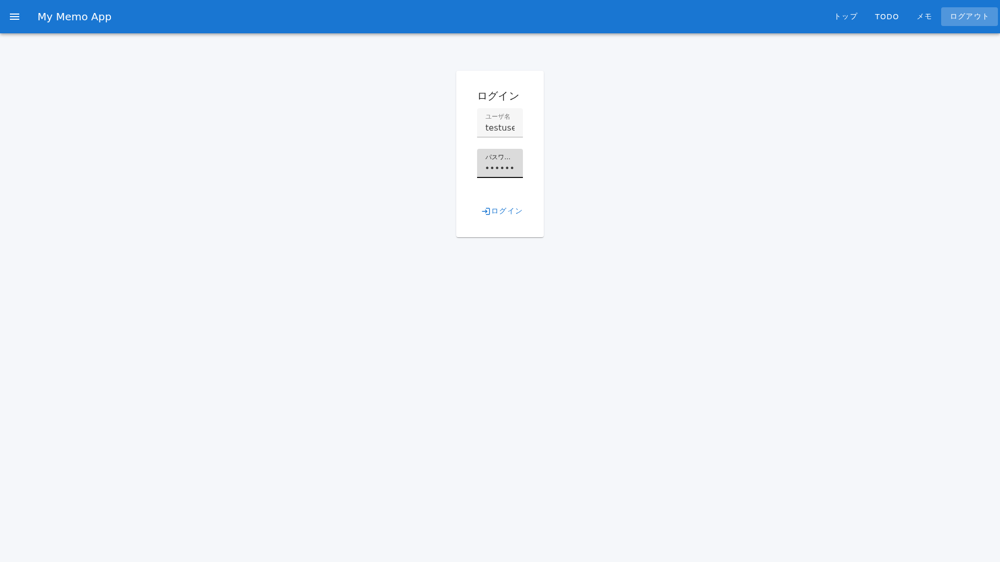
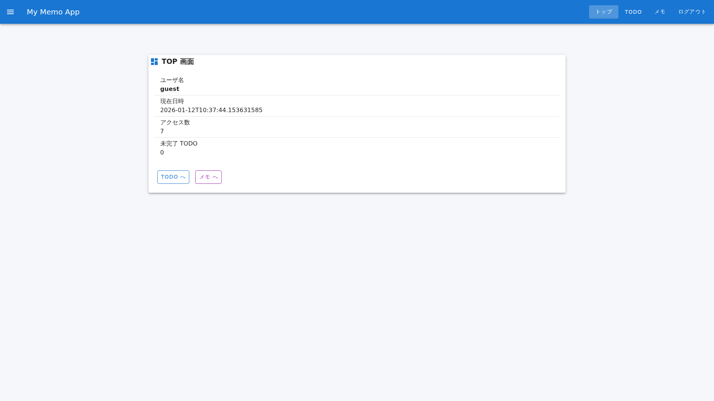
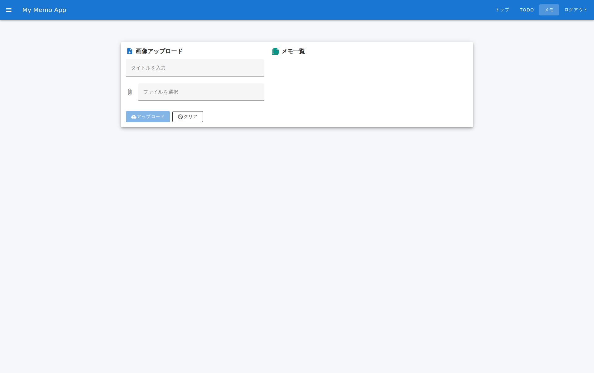

# メモ機能 操作マニュアル

## 概要

### この機能について
メモ機能は、日々の業務中に思いついたことや、会議の内容、重要な情報などを素早く記録できる機能です。テキスト形式で簡潔に保存でき、後から いつでも確認・編集することができます。

### 利用シーン
- **会議中のメモ取り**: 打ち合わせ中に重要な決定事項やタスクを記録する
- **アイデア帳として**: 思いついたアイデアや改善案を即座に書き留める
- **業務ログ**: 日々の業務で実施した内容や気づきをメモして、後で振り返る

---

## 前提条件

- 本システムへのアクセス権限が必要です
- 対応ブラウザ: Chrome、Firefox、Safari、Edge（最新版推奨）
- インターネット接続が必要です

### テストアカウント情報

テスト・検証で使用可能なアカウント情報については、[テストアカウント情報](../test-accounts.md)を参照してください。

---

## 基本操作

### ステップ1: システムへのログイン

まず、システムにログインします。

1. ブラウザで「http://localhost:5173」にアクセスします
2. ログイン画面が表示されます

### ステップ2: ログイン認証情報の入力

3. 「ユーザーID」欄にユーザーIDを入力します（例: `testuser`）

4. 「パスワード」欄にパスワードを入力します

### ステップ3: ログイン実行

5. 「ログイン」ボタンをクリックします
6. ログイン処理が完了するまで数秒待機します

### ステップ4: メモページへの移動

7. ログイン成功後、自動的にダッシュボードが表示されます
8. 画面上部のメニューから「メモ」リンク（またはボタン）をクリックします
9. メモページが表示されます

### ステップ5: メモの入力

10. メモページの入力欄（テキストボックス）をクリックして、記録したい内容を入力します
    - 例: 「2025年1月12日の打ち合わせ内容」、「新機能の実装案」など
11. 入力内容は自動的に反映されます

### ステップ6: メモの保存

12. メモの入力が完了したら、「保存」ボタンをクリックして保存します
    - 保存ボタンが表示される場合: クリックして確定します
    - 自動保存される場合: 特に操作不要で、入力内容が自動的に保存されます
13. 保存完了後、メモがメモ一覧に表示されます

---

## 詳細機能

### メモの一覧表示
メモページに移動すると、これまで作成したメモがすべて表示されます。

### メモの編集
- 作成済みのメモをクリックすると、編集画面が開きます
- 内容を修正して、再度保存します

### メモの削除
- メモ一覧から削除したいメモを選択し、削除ボタンをクリックします
- 確認画面が表示されるため、「削除」を選択して確定します

---

## トラブルシューティング

### ログインできない場合
**症状**: ユーザーID またはパスワードを入力しても「エラー」と表示される

**対策**:
- ユーザーID とパスワードが正しく入力されているか確認してください
- CapsLock が ON になっていないか確認してください
- 空白が誤って含まれていないか確認してください
- 管理者に問い合わせて、アカウント情報を再確認してください

### メモが保存されない場合
**症状**: メモを入力して保存しても、ページを再読み込みするとメモが消える

**対策**:
- インターネット接続が確立されているか確認してください
- 「保存」ボタンをクリック後、完了メッセージが表示されるまで待機してください
- ブラウザのキャッシュをクリアして、再度試してください

### メモが表示されない場合
**症状**: メモページに移動しても、作成したはずのメモが表示されない

**対策**:
- ページを再読み込み（F5 キー）してください
- ブラウザのキャッシュをクリアしてください
- 別のブラウザで試してください

---

## よくある質問

**Q. メモはどのくらい長くできますか？**
A. 制限はありません。長文でも短文でも、自由に入力できます。

**Q. メモを他のユーザーと共有できますか？**
A. 現在のバージョンでは、メモは個人専用です。共有機能は実装されていません。

**Q. メモは何個まで作成できますか？**
A. 個数制限はありません。必要なだけメモを作成できます。

**Q. 削除したメモを復元できますか？**
A. 削除したメモは復元できません。削除の際はご注意ください。

**Q. ログインしないでメモを使用できますか？**
A. いいえ。メモ機能を使用するには、システムへのログインが必須です。

---

## その他のヘルプ

何か不明な点やトラブルが発生した場合は、管理者までお問い合わせください。
