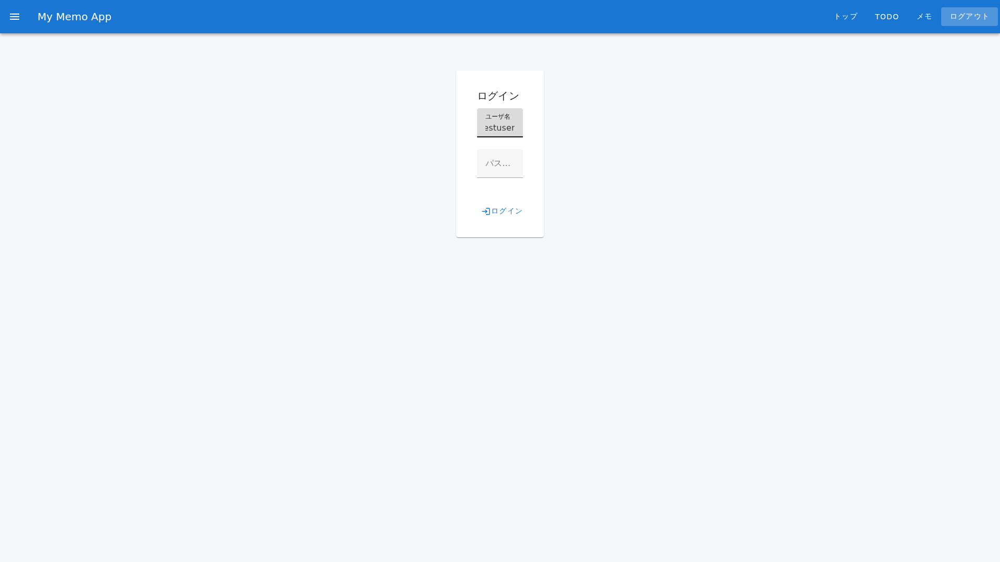

# ログイン機能 ユーザー向け操作マニュアル

## 概要

### この機能について

ログイン機能は、アプリケーションを使用する際に、ユーザーの身元を確認し、個人の情報にアクセスするための重要な機能です。ログイン画面でユーザーIDとパスワードを入力することで、システムにアクセスできます。ログイン後は、TODO管理やメモ機能など、アプリケーションの全機能が利用可能になります。

### 利用シーン

- **朝の業務開始時**: 毎朝、システムにログインして、本日のTODOを確認する
- **リモートワーク時**: 別の場所からアクセスする際に、セキュアにログインしてアカウントを保護する
- **複数デバイスでの利用**: 別のパソコンやタブレットからログインして、どのデバイスからでも同じアカウント情報にアクセスする

---

## 前提条件

### 必要な情報

- **ユーザーID**: アカウント作成時に登録したユーザー識別用のID
- **パスワード**: セキュリティのために設定した秘密の文字列

### 推奨環境

| 項目 | 推奨環境 |
|------|---------|
| **ブラウザ** | Chrome 90以上、Firefox 88以上、Safari 14以上、Edge 90以上 |
| **デバイス** | Windows、Mac、Linux、iOS、Android |
| **ネットワーク** | 安定したインターネット接続 |
| **画面サイズ** | 1024×768以上（スマートフォンでも利用可） |

### アクセス権

- アプリケーションへのアクセス権を有していること
- インターネット接続が可能な環境であること

### テストアカウント情報

テスト・検証で使用可能なアカウント情報については、[テストアカウント情報](../test-accounts.md)を参照してください。

---

## 基本操作

### ステップ1: ログイン画面にアクセス

1. ブラウザのアドレスバーにアプリケーションのURLを入力
2. エンターキーを押してログイン画面を開く

### ステップ2: ユーザーIDを入力

1. ログイン画面の**最初の入力フィールド**にクリック
2. ユーザーID（アカウント作成時に登録したID）を入力
3. 空白や誤字のないか確認

### ステップ3: パスワードを入力

1. **パスワード入力フィールド**（「●●●」のように表示される）にクリック
2. パスワードを入力（画面には「●」で表示されます）
3. CapsLockが有効になっていないか確認（パスワード入力時は大文字小文字が区別されます）

### ステップ4: ログインボタンを押す

1. 画面下部の**「ログイン」ボタン**をクリック
2. ログイン処理が実行される（数秒待機）
3. ログイン成功時は、ダッシュボード画面に遷移

### ステップ5: ログイン完了

1. ダッシュボード画面が表示されたらログイン成功
2. 画面上部のナビゲーションメニューから以下の機能にアクセス可能：
   - **「トップ」**: ホーム画面に戻る
   - **「TODO」**: TODO機能を利用
   - **「メモ」**: メモ機能を利用
   - **「ログアウト」**: システムから退出

---

## 詳細機能

### パスワードを忘れた場合

| 手順 | 操作 | 備考 |
|------|------|------|
| 1 | ログイン画面で「パスワードをお忘れですか？」リンクをクリック | 画面下部に表示 |
| 2 | ユーザーIDまたはメールアドレスを入力 | 登録時の情報を使用 |
| 3 | 「リセットリンクを送信」をクリック | メールが送信されます |
| 4 | メール内のリンクをクリック | 新しいパスワード設定画面へ |
| 5 | 新しいパスワードを入力・確認 | 新しいパスワードでログイン |

### セッションの管理

- **セッションの有効期限**: 最後の操作から30分間、操作がない場合は自動的にログアウト
- **複数デバイスからのログイン**: 同じアカウントで複数のデバイスから同時にログイン可能
- **セキュリティ**: 公共のコンピュータ利用後は必ずログアウトしてください

### ナビゲーションメニュー

ログイン後、画面上部に以下のメニューが表示されます：

| メニュー | 機能 | リンク先 |
|---------|------|---------|
| **トップ** | ホーム画面に移動 | /top |
| **TODO** | TODO管理機能を表示 | /todo |
| **メモ** | メモ管理機能を表示 | /memo |
| **ログアウト** | システムから退出 | /login |

---

## トラブルシューティング

### エラー: 「ユーザーIDまたはパスワードが正しくありません」

**原因**:
- ユーザーIDが間違っている
- パスワードが間違っている
- CapsLockが有効になっている

**対処方法**:
1. ユーザーIDとパスワードを再確認
2. CapsLockキーがオフになっているか確認
3. 入力欄をクリアして、もう一度入力してからログインボタンをクリック
4. 3回以上エラーが続く場合は、「パスワードをお忘れですか？」でパスワードをリセット

### エラー: 「接続がタイムアウトしました」

**原因**:
- インターネット接続が不安定
- サーバーが応答していない

**対処方法**:
1. インターネット接続を確認（Wi-Fi、有線の確認）
2. ページをリロード（F5キーまたは更新ボタンをクリック）
3. 数分待機してから再度ログインを試みる
4. 問題が解決しない場合は、管理者に問い合わせ

### エラー: 「このアカウントは無効化されています」

**原因**:
- アカウントが一時的に無効化されている
- セキュリティ上の理由でロックされている

**対処方法**:
- 管理者に連絡してアカウントの復旧を依頼

### 画面が真っ白で表示されない

**原因**:
- ブラウザのキャッシュが古い
- JavaScriptが有効になっていない

**対処方法**:
1. ブラウザのキャッシュをクリア（Ctrl+Shift+Deleteキー）
2. ブラウザを再起動
3. ブラウザの設定でJavaScriptが有効になっているか確認
4. 別のブラウザで試してみる

### スマートフォンでレイアウトが崩れている

**原因**:
- 画面の向きが横向きになっている
- ブラウザのズームレベルが不適切

**対処方法**:
1. スマートフォンの向きを縦向きに変更
2. ブラウザのズームをリセット（Ctrl+0キー）
3. 画面の向きを固定する設定を確認

---

## よくある質問（FAQ）

### Q1: ログインに失敗した場合、何度まで試すことができますか？

**A**: 一度のセッションで何度でもログインを試すことができます。ただし、複数回失敗した場合は、セキュリティ保護のため一時的にアカウントがロックされる可能性があります。その場合は、数分待機してから再度試してください。

### Q2: 一度ログインすると、どのくらいの期間ログイン状態が保持されますか？

**A**: 最後の操作から30分間、ログイン状態が保持されます。30分間操作がない場合は自動的にログアウトされるため、セキュリティが向上します。

### Q3: 会社のパソコンとプライベートのパソコンから同時にログインできますか？

**A**: はい、同じアカウントで複数のデバイスから同時にログインすることが可能です。ただし、セキュリティ上の理由から、公共のコンピュータ使用後は必ずログアウトしてください。

### Q4: スマートフォンからもログインできますか？

**A**: はい、iOS、Android共にスマートフォンからログイン可能です。ブラウザを開いてアプリケーションのURLにアクセスしてください。レイアウトは自動的にスマートフォンに最適化されます。

### Q5: ログイン情報は安全ですか？

**A**: はい、パスワードは暗号化されて安全に保存されています。絶対にパスワードを他人と共有しないでください。管理者やスタッフがパスワードの提出を求めることはありません。

### Q6: ブラウザを閉じるとログアウトされますか？

**A**: いいえ、ブラウザを閉じてもログイン状態は保持されます。ただし、明示的に「ログアウト」をクリックするか、30分間操作がない場合にはログアウトされます。セキュリティが心配な場合は、使用終了後に「ログアウト」ボタンをクリックすることをお勧めします。

---

## セキュリティ上の注意事項

### 重要な注意事項

1. **パスワード管理**
   - パスワードは絶対に他人に教えないでください
   - 定期的にパスワードを変更することをお勧めします（最低3ヶ月に1回）
   - 簡単なパスワード（誕生日、「123456」など）は避けてください

2. **公共のコンピュータ使用時**
   - 使用終了後は必ず「ログアウト」をクリックしてください
   - 「ブラウザのパスワード保存」機能は使用しないでください

3. **不審なアクティビティに気づいた場合**
   - すぐにパスワードを変更してください
   - 管理者に報告してください

4. **フィッシング詐欺への注意**
   - 疑わしいメールからのリンクでログイン画面にアクセスしないでください
   - 常に公式のURLからアクセスしてください

---

## お問い合わせ

ログイン機能に関するご質問やトラブルがある場合は、以下の手段でお問い合わせください：

- **管理者メール**: admin@example.com
- **ヘルプデスク**: help-desk@example.com
- **営業時間**: 平日 09:00 - 17:00（祝日を除く）

---

**作成日**: 2026年1月  
**最終更新**: 2026年1月12日  
**バージョン**: 2.0
